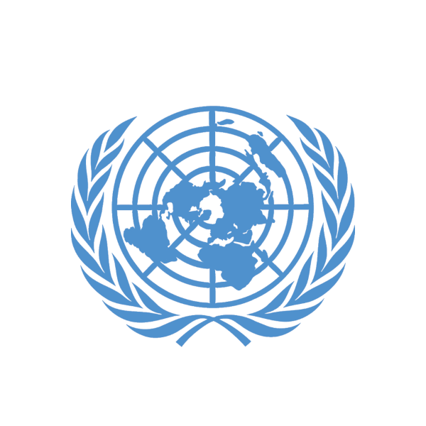
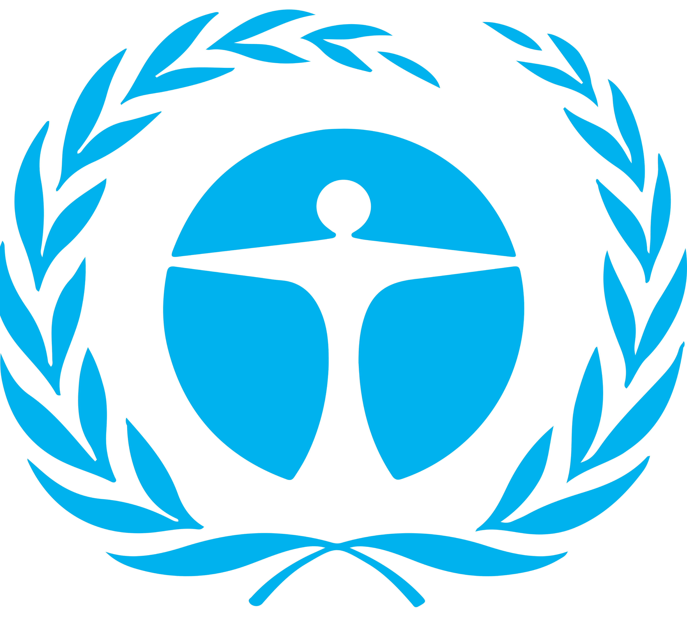
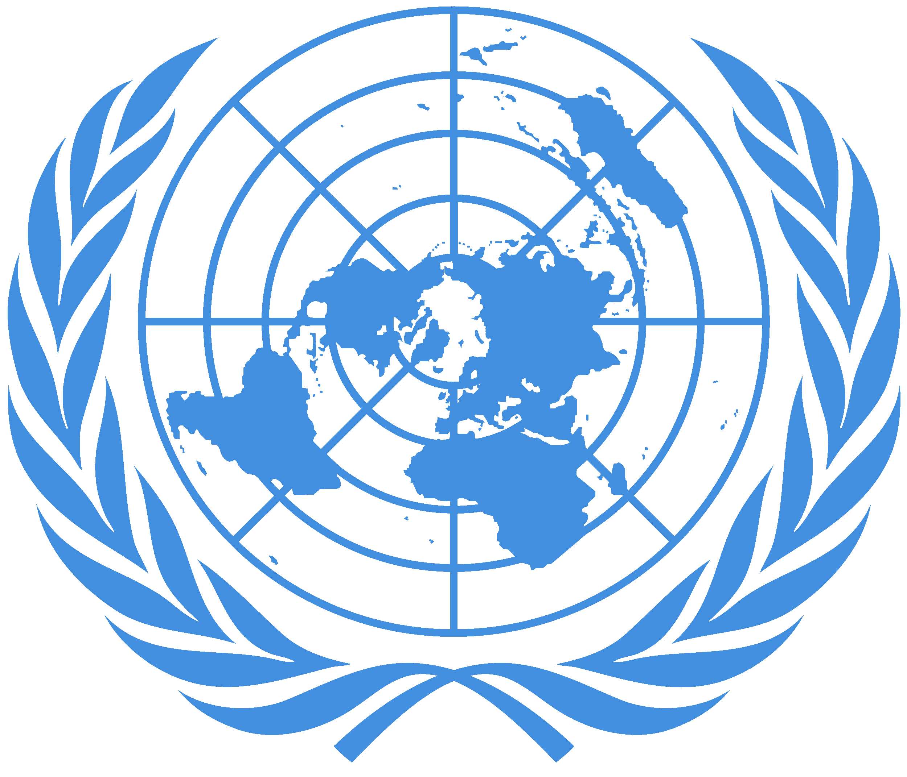
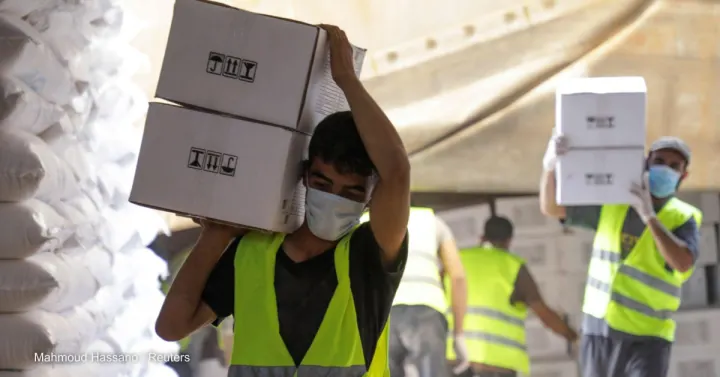
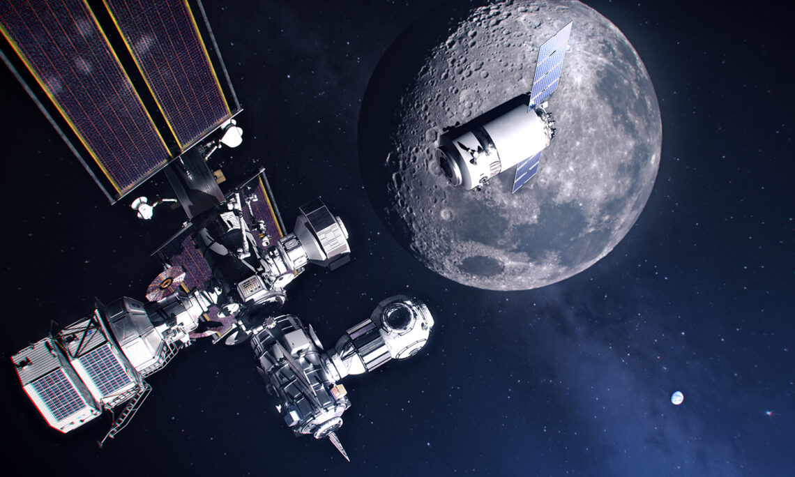
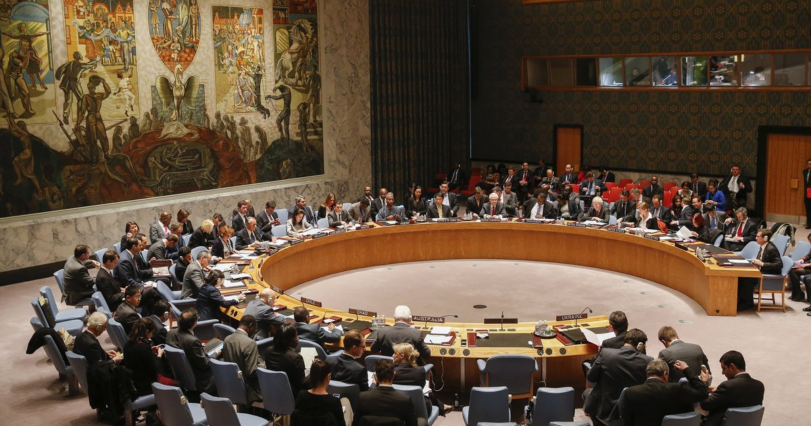

---
# Feel free to add content and custom Front Matter to this file.
# To modify the layout, see https://jekyllrb.com/docs/themes/#overriding-theme-defaults

layout: default
---

<!-- Navigation-->
<nav class="navbar navbar-expand-lg navbar-dark fixed-top" id="mainNav">
    

        <a class="navbar-brand" href="#page-top">WESTMUN 2022</a>
        <button class="navbar-toggler" type="button" data-bs-toggle="collapse" data-bs-target="#navbarResponsive"
            aria-controls="navbarResponsive" aria-expanded="false" aria-label="Toggle navigation">
            Menu
            <i class="fas fa-bars ms-1"></i>
        </button>
        

            <ul class="navbar-nav text-uppercase ms-auto py-4 py-lg-0">
                <li class="nav-item"><a class="nav-link" href="#dates">Dates</a></li>
                <li class="nav-item"><a class="nav-link" href="#committees">Committees</a></li>
                <li class="nav-item"><a class="nav-link" href="#resources">Resources</a></li>
                <!--
                <li class="nav-item"><a class="nav-link" href="#team">Team</a></li>
                <li class="nav-item"><a class="nav-link" href="#contact">Contact</a></li>
                -->
            </ul>
        

    

</nav>
<!-- Masthead-->
<header class="masthead">
    

        
WESTMUN 2022

        
A Model United Nations Conference at Westonbirt School

        <a class="btn btn-primary btn-xl text-uppercase" href="#dates">Tell Me More</a>
    

</header>
<!-- Services-->
<section class="page-section" id="dates">
    

        

            <h2 class="section-heading text-uppercase">Date / Time</h2>
            <h3 class="section-subheading text-muted">Friday, 25th March 2022 - 5pm to 9pm - including dinner</h3>
            
<strong>Welcome to WESTMUN!</strong> - this Model United Nations conference will give your
                team the opportunity to develop your skills in leadership, debate, public speaking and negotiation, as
                well as considering how to solve the major issues facing the world, all within a structured and
                supportive environment. We look forward to welcoming you to Westonbirt School on Friday, 25th March
                2022. To enter one or more delegations, please email office@westonbirtschool.uk. Each delegation should be composed of between five and eight pupils.

        

        <!--
        

            

                
                    <i class="fas fa-circle fa-stack-2x text-primary"></i>
                    <i class="fas fa-shopping-cart fa-stack-1x fa-inverse"></i>
                
                <h4 class="my-3">UCoST</h4>
                
UN Commission on Science and Technology for Development

            

            

                
                    <i class="fas fa-circle fa-stack-2x text-primary"></i>
                    <i class="fas fa-laptop fa-stack-1x fa-inverse"></i>
                
                <h4 class="my-3">Responsive Design</h4>
                
Lorem ipsum dolor sit amet, consectetur adipisicing elit. Minima maxime quam architecto quo inventore harum ex magni, dicta impedit.

            

            

                
                    <i class="fas fa-circle fa-stack-2x text-primary"></i>
                    <i class="fas fa-lock fa-stack-1x fa-inverse"></i>
                
                <h4 class="my-3">Web Security</h4>
                
Lorem ipsum dolor sit amet, consectetur adipisicing elit. Minima maxime quam architecto quo inventore harum ex magni, dicta impedit.

            

        

-->
    

</section>
<!-- MUN Committees-->
<section class="page-section bg-light" id="committees">
    

        

            <h2 class="section-heading text-uppercase">Committees</h2>
            <h3 class="section-subheading text-muted">The following committees will sit at WESTMUN 2022.</h3>
        

        

            

                <!-- Portfolio item 1-->
                

                    <a class="portfolio-link" data-bs-toggle="modal" href="#portfolioModal1">
                        

                            
<i class="fas fa-plus fa-3x"></i>

                        

                        
                    </a>
                    

                        
UCoST

                        
UN Commission on Science and Technology for
                            Development

                    

                

            

            

                <!-- Portfolio item 2-->
                

                    <a class="portfolio-link" data-bs-toggle="modal" href="#portfolioModal2">
                        

                            
<i class="fas fa-plus fa-3x"></i>

                        

                        
                    </a>
                    

                        
UNEP

                        
United Nations Environment Programme

                    

                

            

            

                <!-- Portfolio item 3-->
                

                    <a class="portfolio-link" data-bs-toggle="modal" href="#portfolioModal3">
                        

                            
<i class="fas fa-plus fa-3x"></i>

                        

                        
                    </a>
                    

                        
UNCTAD

                        
United Nations Conference on Trade and
                            Development

                    

                

            

            

                <!-- Portfolio item 4-->
                

                    <a class="portfolio-link" data-bs-toggle="modal" href="#portfolioModal4">
                        

                            
<i class="fas fa-plus fa-3x"></i>

                        

                        
                    </a>
                    

                        
SOCHUM

                        
Social, Cultural, and Humanitarian
                            Committee

                    

                

            

            

                <!-- Portfolio item 5-->
                

                    <a class="portfolio-link" data-bs-toggle="modal" href="#portfolioModal5">
                        

                            
<i class="fas fa-plus fa-3x"></i>

                        

                        
                    </a>
                    

                        
UNOOSA

                        
United Nations Office for Outer Space
                            Affairs

                    

                

            

            

                <!-- Portfolio item 6-->
                

                    <a class="portfolio-link" data-bs-toggle="modal" href="#portfolioModal6">
                        

                            
<i class="fas fa-plus fa-3x"></i>

                        

                        
                    </a>
                    

                        
UNSC

                        
United Nations Security Council

                    

                

            

        

    

</section>
<!-- About-->
<section class="page-section" id="resources">
    

        

            <h2 class="section-heading text-uppercase">Resources</h2>
            <h3 class="section-subheading text-muted">The resources below will give you some details about the evening
                and help you to prepare your delegations.</h3>
        

        <ul class="timeline">
            <li>
                

                

                    

                        <h4>5.00PM</h4>
                        <h4 class="subheading">Arrival</h4>
                    

                    

                        
Delegates arrive in the Great Hall.

                    

                

            </li>
            <li class="timeline-inverted">
                

                

                    

                        <h4>5.30PM</h4>
                        <h4 class="subheading">General Assembly</h4>
                    

                    

                        
The General Assembly convenes in the Orangery, to introduce the Committees and the topics for debate.

                    

                

            </li>
            <li>
                

                

                    

                        <h4>6.00PM</h4>
                        <h4 class="subheading">Committee Debates</h4>
                    

                    

                        
Committees move to break-out rooms for the discussion and development of their resolutions.

                    

                

            </li>
            <li class="timeline-inverted">
                

                

                    

                        <h4>7.00PM</h4>
                        <h4 class="subheading">Dinner</h4>
                    

                    

                        
Dinner for all delegates. This is an opportunity to continue the debate!

                    

                

            </li>
            <li class="timeline-inverted">
                

                

                    

                        <h4>8.00PM</h4>
                        <h4 class="subheading">Return to Committees</h4>
                    

                    

                        
Resolutions are finalised within Committees.

                    

                

            </li>
            <li class="timeline">
                

                

                    

                        <h4>8.30PM</h4>
                        <h4 class="subheading">General Assembly</h4>
                    

                    

                        
The General Assembly reconvenes, to vote on the various resolutions.

                    

                

            </li>
        </ul>
    

</section>
<!-- Team-->
<!--
<section class="page-section bg-light" id="team">
    

        

            <h2 class="section-heading text-uppercase">Our Amazing Team</h2>
            <h3 class="section-subheading text-muted">Lorem ipsum dolor sit amet consectetur.</h3>
        

        

            

                

                    
                    <h4>Parveen Anand</h4>
                    
Lead Designer

                    <a class="btn btn-dark btn-social mx-2" href="#!"><i class="fab fa-twitter"></i></a>
                    <a class="btn btn-dark btn-social mx-2" href="#!"><i class="fab fa-facebook-f"></i></a>
                    <a class="btn btn-dark btn-social mx-2" href="#!"><i class="fab fa-linkedin-in"></i></a>
                

            

            

                

                    
                    <h4>Diana Petersen</h4>
                    
Lead Marketer

                    <a class="btn btn-dark btn-social mx-2" href="#!"><i class="fab fa-twitter"></i></a>
                    <a class="btn btn-dark btn-social mx-2" href="#!"><i class="fab fa-facebook-f"></i></a>
                    <a class="btn btn-dark btn-social mx-2" href="#!"><i class="fab fa-linkedin-in"></i></a>
                

            

            

                

                    
                    <h4>Larry Parker</h4>
                    
Lead Developer

                    <a class="btn btn-dark btn-social mx-2" href="#!"><i class="fab fa-twitter"></i></a>
                    <a class="btn btn-dark btn-social mx-2" href="#!"><i class="fab fa-facebook-f"></i></a>
                    <a class="btn btn-dark btn-social mx-2" href="#!"><i class="fab fa-linkedin-in"></i></a>
                

            

        

        

            

                
Lorem ipsum dolor sit amet, consectetur adipisicing elit. Aut eaque,
                    laboriosam veritatis, quos non quis ad perspiciatis, totam corporis ea, alias ut unde.

            

        

    

</section>
-->
<!-- Footer-->
<footer class="footer py-4">
    

        

            
Copyright &copy; Westonbirt School 2022

            

                <a class="btn btn-dark btn-social mx-2" href="https://twitter.com/WestonbirtSch"><i
                        class="fab fa-twitter"></i></a>
                <a class="btn btn-dark btn-social mx-2" href="https://www.facebook.com/WestonbirtSch"><i
                        class="fab fa-facebook-f"></i></a>
                <a class="btn btn-dark btn-social mx-2" href="https://www.linkedin.com/school/westonbirt-schools/"><i
                        class="fab fa-linkedin-in"></i></a>
            

            

                <a class="link-dark text-decoration-none me-3" href="#!">Privacy Policy</a>
                <a class="link-dark text-decoration-none" href="#!">Terms of Use</a>
            

        

    

</footer>
<!-- Portfolio Modals-->
<!-- Portfolio item 1 modal popup-->

    

        

            

            

            

                

                    

                        

                            <!-- Project details-->
                            <h2 class="text-uppercase">UCoST</h2>
                            
UN Commission on Science and Technology for Development

                            
                            
The United Nations Commission on Science and Technology for Development (CSTD) is the
                                United Nations’ home for discussions on science and technology – what is new, what
                                matters, what is changing, what the impact is – and how this affects development and a
                                sustainable future for all.

                            
It is the forum that helps ask and frame the critical issues influencing the fields of science and technology today.

                            
Some of the important normative issues raised include the technology and life interface, as well as governance of the use and development of frontier technologies – namely, big data analytics, biotech and genome editing, the Internet of things (IoT) and artificial intelligence.

                            
The CSTD is also an open platform where proposals, ideas, experiences, cases, and
                                intellectual thought can be channeled toward making a policy impact. It facilitates
                                concrete collaborations between member states, NGOs and actors in the science,
                                technology and development space.

                            
<strong>Debate topics:</strong>

                            <ul class="list-inline">
                                <li>The Question of Artificial Intelligence</li>
                                <li>The Question of the Metaverse</li>
                            </ul>
                            <button class="btn btn-primary btn-xl text-uppercase" data-bs-dismiss="modal" type="button">
                                <i class="fas fa-times me-1"></i>
                                Close Page
                            </button>
                        

                    

                

            

        

    

<!-- Portfolio item 2 modal popup-->

    

        

            

            

            

                

                    

                        

                            <!-- Project details-->
                            <h2 class="text-uppercase">UNEP</h2>
                            
United Nations Environment Programme

                            
                            
Since its inception in 1972, the United Nations Environment Programme (UNEP) has been the global authority that sets the environmental agenda, promotes the coherent implementation of the environmental dimension of sustainable development within the United Nations system and serves as an authoritative advocate for the global environment.

                            
UNEP’s mission is to provide leadership and encourage partnership in caring for the environment by inspiring, informing, and enabling nations and peoples to improve their quality of life without compromising that of future generations.

                            
<strong>Debate topics:</strong>

                            <ul class="list-inline">
                                <li>The Question of the Sustainable Development Goals</li>
                                <li>The Question of Geoengineering</li>
                            </ul>
                            <button class="btn btn-primary btn-xl text-uppercase" data-bs-dismiss="modal" type="button">
                                <i class="fas fa-times me-1"></i>
                                Close Project
                            </button>
                        

                    

                

            

        

    

<!-- Portfolio item 3 modal popup-->

    

        

            

            

            

                

                    

                        

                            <!-- Project details-->
                            <h2 class="text-uppercase">UNCTAD</h2>
                            
United Nations Conference on Trade and Development

                            
                            
Globalization, including a phenomenal expansion of trade, has helped lift millions out of poverty. But not nearly enough people have benefited. And tremendous challenges remain.

                            
We support developing countries to access the benefits of a globalized economy more fairly and effectively. And we help equip them to deal with the potential drawbacks of greater economic integration. To do this, we provide analysis, facilitate consensus-building, and offer technical assistance. This helps them to use trade, investment, finance, and technology as vehicles for inclusive and sustainable development.

                            
<strong>Debate topics:</strong>

                            <ul class="list-inline">
                                <li>The Question of Finance for Development</li>
                                <li>The Question of Cryptocurrency</li>
                            </ul>
                            <button class="btn btn-primary btn-xl text-uppercase" data-bs-dismiss="modal" type="button">
                                <i class="fas fa-times me-1"></i>
                                Close Page
                            </button>
                        

                    

                

            

        

    

<!-- Portfolio item 4 modal popup-->

    

        

            

            

            

                

                    

                        

                            <!-- Project details-->
                            <h2 class="text-uppercase">SOCHUM</h2>
                            
Social, Cultural, and Humanitarian Committee.

                            
                            
The General Assembly allocates to the Social, Cultural, and Humanitarian Committee, agenda items relating to a range of social, humanitarian affairs and human rights issues that affect people all over the world.

                            
As in previous sessions, an important part of the work of the Committee will focus on the examination of human rights questions, including reports of the special procedures of the Human Rights Council which was established in 2006. In October 2020, the Committee will hear and interact with special rapporteurs, independent experts, and chairs of working groups as mandated by the Human Rights Council.

                            
The Committee also discusses questions relating to the advancement of women, the protection of children, indigenous issues, the treatment of refugees, the promotion of fundamental freedoms through the elimination of racism and racial discrimination, and the right to self- determination.  The Committee also addresses important social development questions such as issues related to youth, family, ageing, persons with disabilities, crime prevention, criminal justice, and international drug control.

                            
<strong>Debate topics:</strong>

                            <ul class="list-inline">
                                <li>The Question of Refugees from War</li>
                                <li>The Question of the International Drug Trade</li>
                            </ul>
                            <button class="btn btn-primary btn-xl text-uppercase" data-bs-dismiss="modal" type="button">
                                <i class="fas fa-times me-1"></i>
                                Close Page
                            </button>
                        

                    

                

            

        

    

<!-- Portfolio item 5 modal popup-->

    

        

            

            

            

                

                    

                        

                            <!-- Project details-->
                            <h2 class="text-uppercase">UNOOSA</h2>
                            
United Nations Office for Outer Space Affairs

                            
                            
The United Nations Office for Outer Space Affairs (UNOOSA) works to promote international cooperation in the peaceful use and exploration of space, and in the utilisation of space science and technology for sustainable economic and social development. The Office assists any United Nations Member States to establish legal and regulatory frameworks to govern space activities and strengthens the capacity of developing countries to use space science technology and applications for development by helping to integrate space capabilities into national development programmes.

                            
<strong>Debate topics:</strong>

                            <ul class="list-inline">
                                <li>The Question of settling on Mars</li>
                                <li>The Question of war in space</li>
                            </ul>
                            <button class="btn btn-primary btn-xl text-uppercase" data-bs-dismiss="modal" type="button">
                                <i class="fas fa-times me-1"></i>
                                Close Page
                            </button>
                        

                    

                

            

        

    

<!-- Portfolio item 6 modal popup-->

    

        

            

            

            

                

                    

                        

                            <!-- Project details-->
                            <h2 class="text-uppercase">UNSC</h2>
                            
United Nations Security Council

                            
                            
The Security Council has primary responsibility for the maintenance of international peace and security. It has 15 Members, and each Member has one vote. Under the Charter of the United Nations, all Member States are obligated to comply with Council decisions.

                            
The Security Council takes the lead in determining the existence of a threat to the peace or act of aggression. It calls upon the parties to a dispute to settle it by peaceful means and recommends methods of adjustment or terms of settlement. In some cases, the Security Council can resort to imposing sanctions or even authorize the use of force to maintain or restore international peace and security.

                            
<strong>Debate topics:</strong>

                            <ul class="list-inline">
                                <li>The Question of Ukraine</li>
                                <li>The Question of Syria</li>
                            </ul>
                            <button class="btn btn-primary btn-xl text-uppercase" data-bs-dismiss="modal" type="button">
                                <i class="fas fa-times me-1"></i>
                                Close Page
                            </button>
                        

                    

                

            

        

    

<!-- Bootstrap core JS-->

<!-- Core theme JS-->

<!-- * * * * * * * * * * * * * * * * * * * * * * * * * * * * * * * * * * * * * * * *-->
<!-- * *                               SB Forms JS                               * *-->
<!-- * * Activate your form at https://startbootstrap.com/solution/contact-forms * *-->
<!-- * * * * * * * * * * * * * * * * * * * * * * * * * * * * * * * * * * * * * * * *-->
